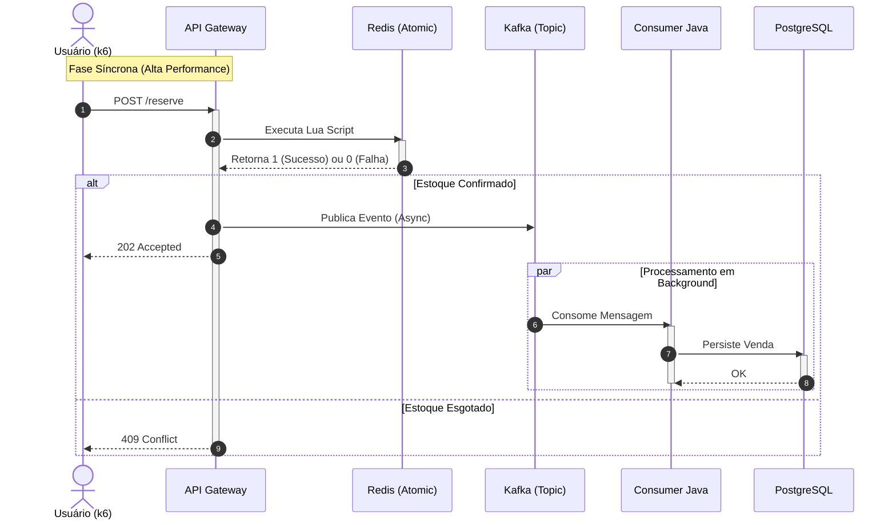

# ⚡ Flash Sale Engine (High Concurrency)

Um motor de vendas de alta performance projetado para suportar picos extremos de tráfego (ex: Black Friday), garantindo **Zero Overselling** e **Baixa Latência**.

## 🚀 Sobre o Projeto

Este sistema simula o backend de um e-commerce lidando com milhares de requisições por segundo para um item de estoque limitado. O objetivo principal é resolver o problema de **Condição de Corrida** em sistemas distribuídos. O objetivo principal é resolver o problema de Condição de Corrida em sistemas distribuídos, uma questão comum em cenários como a venda de ingressos de alta demanda ou "Flash Sales"

### 🏆 Desafios Técnicos Resolvidos

* **Prevenção Total de Overselling:** Utilização de **Redis + Lua Script** para garantir operações atômicas de decremento de estoque. Isso elimina a concorrência desleal entre threads que ocorre em bancos de dados tradicionais, prevenindo o overselling (venda de mais itens do que o disponível)
* **Backpressure & Assincronismo:** O sistema desacopla a recepção do pedido (API) da persistência (Banco de Dados) usando **Apache Kafka**. Isso permite que a API responda em milissegundos (latência P95 < 30ms) mesmo que o banco de dados esteja lento
* **Idempotência:** O Consumer do **Kafka** implementa padrões para garantir que uma mesma venda nunca seja processada duas vezes, mesmo em casos de falha de rede

###💡 Decisões Técnicas (Architecture Decision Records - ADRs)

Esta seção detalha as escolhas de arquitetura que transformam este projeto em um sistema de alta resiliência, demonstrando o domínio de **sistemas distribuídos.**
1. Escolha de Java/Spring Boot para Alta Concorrência:
2. Uso de Redis e Lua Scripts para Atomicidade:
3. Implementação de Arquitetura Event-Driven com Kafka:

## 🏗️ Arquitetura do Sistema

O fluxo segue o padrão **Event-Driven** para garantir baixa latência:



## 📊 Resultados de Performance (k6)

Teste realizado com 100 Virtual Users simultâneos:
* **Throughput:** ~1.800 RPS (Requests Per Second) em ambiente local.
* **Latência P95:** ~28ms.
* **Consistência:** 0 erros de estoque em 100k+ tentativas de compra.

## 🎥 Demonstração

Veja o sistema em ação processando 100% das vendas sem overselling:
https://github.com/eduardobm0708/flash-sale-engine-java/issues/1#issue-3669488415

## 🛠️ Tech Stack

* **Java 21 & Spring Boot 3**
* **Redis (Cache & Atomic Locks)**
* **Apache Kafka (Event Streaming)**
* **PostgreSQL (Persistência)**
* **Docker & Docker Compose**
* **k6 (Testes de Carga)**
* **Prometheus & Grafana (Observabilidade)**

## ⚙️ Como Rodar

A facilidade de execução é crucial. Siga os passos abaixo para iniciar a aplicação e testar o sistema de Flash Sale:

### 1. Subir a infraestrutura
Inicie os serviços do Docker (PostgreSQL, Redis, Kafka, Prometheus, Grafana)

    ```bash
    docker-compose up -d
    ```

2. Inicie a aplicação Spring Boot via sua IDE favorita (IntelliJ, Eclipse) ou usando Maven:

    ```bash
    mvn spring-boot:run
    ```

3. Popule o estoque no Redis:
Popule o estoque no Redis (neste exemplo, 100 unidades do item iphone_15)

   ```bash
   docker exec -it flashsale_redis redis-cli SET iphone_15 100
   ```

4. Realize um pedido de teste:
Utilize o curl para realizar um pedido

   ```bash
    curl -X POST http://localhost:8080/reserve \
    -H "Content-Type: application/json" \
    -d '{"userId":"user1", "itemId":"iphone_15", "quantity":1}'
   ```
---
